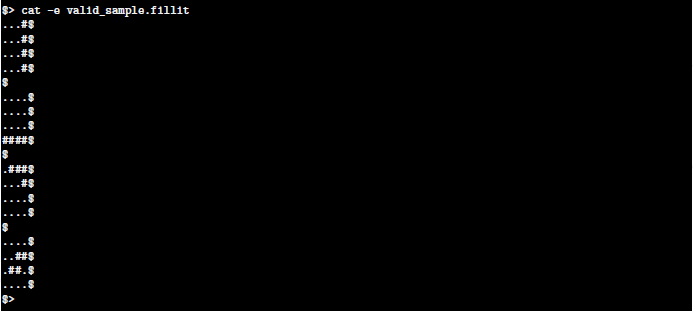
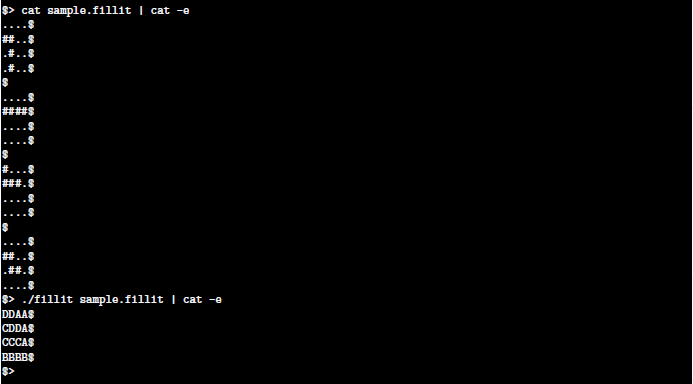
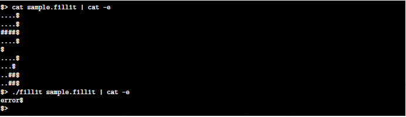

# fillit
This is a story of a piece of Tetris, one little square and a dev having walked into a bar...

---------------------------------------------------------------------------------------------

This is one of the projects at School 21 (Ecole 42 franchise).

The program takes a file as a parameter which contains a list of Tetriminos (= Tetris blocks), 
and arranges them in order to create the smallest square possible.

 

## Program input

#### File:
 - contains between 1 and 26 Tetriminos
 - all the Tetriminos are separated by a newline
 
#### Tetrimino:
 - a Tetrimino is a piece of Tetris composed of 4 blocks
 - precisely 4 lines of 4 characters (+ \n)
 - each character must be either a block character('#') or an empty character ('.')
 - each block of a Tetrimino must touch at least one other block on any of his 4 sides 
   (up, down, left and right)
   
**_Example of a valid file:_**

 

## Program output

The program displays the smallest assembled square on the standard output.

Tetriminos are arranged by their order of appearance in the file. Among all the possible
candidates for the smallest square, the one where Tetriminos are placed in their most 
upper-left position is valid.

Each Tetrimino is assigned a capital letter starting with ’A’ in their order of appearance 
in the file.

If the file contains at least one error, the program displays "error" on the standard
output followed by a newline.

**_Examples of a valid output:_**

